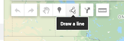
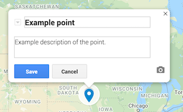

### Getting started

* Log in to your Google account (your UW account or your personal account will work) and go to Google My Maps: https://www.google.com/mymaps
* On the welcome page, select ```+CREATE A NEW MAP```
* Change the title of the map to something more descriptive than "Untitled Map" and add a description in the Description dialog box. You can come back to this and edit it at any time. 
* Use the ```share``` option to set your map to 'Public on the Web' or 'Anyone with the Link' so that I can view your work when you submit it

### Adding data to your map

There are a number of ways to add data to your map. Your needs will vary depending on your project and the kind(s) of data that you're including. 

#### Manually adding data

* The simplest way to add data to a Google My Map is to draw it manually. You can draw points lines and polygons onto your map using the draw tools along the top of the page. 

* The tool highlighted in the picture above allows you to draw lines and polygons, and the tool with the marker icon to its left allows you to add points.
* When you add a feature, you will be able to save a title for the feature. You can also add a description and attach photos or videos. 

* You can organize your features into layers in the menu on the left side of the screen


#### Importing data 

* You may want to use data sets that already exist instead of manually drawing all of your features. You can import data into your map as a table or as a KML or GPX (two data formats that are somewhat analogous to a Shapefile). These instructions will focus on KML data. 
* To import data, begin by adding a new layer in the menu on the left, then click the ```Import``` button in that layer. 

**Importing table data**

* You can import table data in either the .xlsx file format or the .csv file format. This can be a table that you've created yourself or a table that you've downloaded from another source. 
* You need to have location data (e.g. latitude and longitude coordinates for a set of points) saved in one of the columns of your table in order for the data to display.
* When you upload your data, the dialog window will walk you through selecting which column in the table contains the location data and which column you want to use to title your markers. 

**Importing KML data**

* KML stands for Keyhole Markup Language, and it is a format for geographic data that, much like Shapefiles, stores both the geometry of a set of features (points, lines, and polygons) and tabular data associated with each feature. If you're curious, you can learn more about the file format here: https://en.wikipedia.org/wiki/Keyhole_Markup_Language
* Plenty of data repositories make data available to download in the KML format. However it is also possible to export data from ArcMap into the KML format. 
* Here is an example of a data set that can be downloaded as a KML: https://data.seattle.gov/Land-Base/Bike-Racks/pbej-cxb2 If you don't want to mess with data conversions, look for data that can be downloaded readily as KML.
* If you have done some analysis or processing of your data in ArcMap and want to export it from ArcMap to KML, follow these instructions: https://desktop.arcgis.com/en/arcmap/10.3/manage-data/kml/creating-kml-in-arcgis-for-desktop.htm
* NOTE 1: only export individual layers to KML, not entire maps. You will style your layers later within My Maps itself, so exporting from ArcMap as individual layers is recommended. 
* NOTE 2: You can only export KMLs that are 5mb or less in size. If you need to include a file that is larger than that, get in touch with me to discuss ways to simplify/shrink your data file. 

### Styling your map

It is possible to customize the look of your map in a number of ways. These include the appearance of the features, the information that is included in popup windows, and the basemap style. 

**Styling features**

* You can style features individually, by layer, or by data column. 
* Experiment with these options in the menu on the left and choose a style that makes sense for your data. 
* You can also change the color of features, change the icon for points, and adjust the opacity of lines and polygons. Hover over a feature that you would like to edit and click the symbol that looks like a dripping paint bucket to experiment with this. Make symbolization choices that make sense for your data. 

**Customizing popup windows**

* When you import data from a spreadsheet or KML, by default, every column in the data table is displayed in the pop-up window. This may be far more data than you wish to display or than is helpful to a map viewer. To remove any of the information from the data window, follow these steps: 
* Click on one of teh features in the imported layer. 
* Select the pencil icon to edit the popup. 
* Exclude data columns from the popup window by un-checking the box next to the data category. 
* When you hit 'save', your changes should apply to all features in the layer (but it's a good idea to confirm that by clicking on another feature from the one you edited and examining its popup window).

**Change the base map**

* At the bottom of the table of contents menu on the left, there is a base map layer. 
* Click the triangle next to the 'Base map' label and you can select one of nine options for your base map. Choose one that goes well with the symbolization you chose for your vector data, that provides adequate figure-ground, and provides sufficient spatial context for your project's needs. 

### Sharing your map

When you are ready to share your finished project, you can share it in one of two ways. 

* To get a link to the map, click the ```Share``` button, ensure that access is set to 'Public on the web' or 'anyone with the link', and copy the sharing link at the top of the dialog window. Please post this link on the class discussion board on Canvas, per the instructions 
* To embed your map as an iframe in an existing website (such as a portfolio site, if you have one for your GIS work), you can get the embed code by clicking on the three vertical dots to the right of your map's title and choosing "embed on my site."

